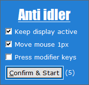

# AntiIdler
#### Prevents user from idling in Windows

- #### Every 30seconds checks if user had no input from keyboard or mouse
- If not, checks if the current active window is fullscreen, to not interrupt like watching a movie
- Then executes the anti idle methods

- Supports mouse dragging the window
- Supports auto activation in background after started, until the user moves the mouse over
